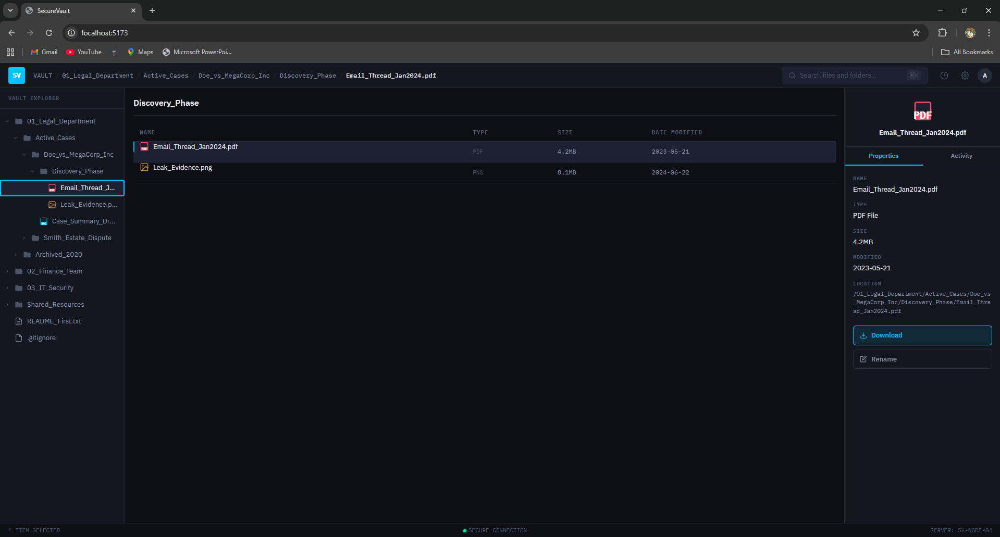

# SecureVault Dashboard

A keyboard-first file explorer built for enterprise teams who need to navigate, audit, and manage sensitive documents.


SecureVault Dashboard is an enterprise-grade file management interface designed for law firms and banks. It runs entirely in the browser, uses a dark theme optimized for long working sessions, and is built around keyboard navigation so power users never have to reach for a mouse.

---

## Preview



---

## Features

- **Recursive folder tree** that handles files and folders nested at any depth no artificial limit on how deep the structure can go
- **Expand and collapse folders** by clicking, with smooth chevron animations indicating state
- **File properties panel** click any file to see its name, type, size, location in the vault, and last modified date in a slide-in side panel
- **Full keyboard navigation** Tab to focus the tree, then use arrow keys to move through it, Enter to open a file or toggle a folder, no mouse required
- **Live search** that filters the entire tree as you type and automatically opens every ancestor folder containing a match, so results are always visible in context
- **Audit Trail** every time a file is opened or downloaded, the app logs the action with a timestamp and the file path; a dedicated Activity tab shows the history for each file, and a global overlay shows the complete log across all files

---

## Tech Stack

| Technology | Purpose |
|---|---|
| React 18 | Component model and state management via hooks |
| TypeScript 5 | Strict typing across all components, hooks, and utilities |
| Vite 5 | Development server and production bundler |
| CSS Custom Properties | Design system all colors, spacing, and typography as variables |
| Plain CSS | Component-level styles; no preprocessor needed |

---

## Getting Started

### Prerequisites

- Node.js 18 or higher
- npm

### Installation

1. Clone the repository

```bash
git clone https://github.com/Wilson-deve/Secure-Vault.git
cd Secure-Vault
```

2. Install dependencies

```bash
npm install
```

3. Start the development server

```bash
npm run dev
```

4. Open [http://localhost:5173](http://localhost:5173) in your browser

### Build for Production

```bash
npm run build
```

The output is written to `dist/` and is ready to be served from any static host.

---

## Design File

> The full design system color palette, typography, spacing grid, and component states was designed in **[→ View Design File on Figma](https://www.figma.com/design/aNlf7kM8ZevEACrTzk4ruL/Secure-Vault-design?node-id=0-1&t=oZnBo21SzPyyjXI2-1)** 

---

## Project Structure

```
src/
  components/
    layout/       — AppShell, Sidebar, MainPanel, PropertiesPanel
    explorer/     — TreeNode (recursive), FileRow, Breadcrumb
    search/       — SearchBar
    audit/        — ActivityLog, AuditOverlay
    ui/           — FileIcon
  hooks/          — useKeyboardNav, useSearch, useAuditLog
  data/           — data.json (provided dataset)
  types/          — TypeScript interfaces
  styles/         — global.css (CSS variables design system)
  utils/          — treeUtils.ts (path computation helpers)
```

---

## How the Recursive Tree Works

### The data is a tree, not a flat list

The source data is a JSON structure where folders can contain other folders, which can contain more folders, going as deep as needed. A simple loop over a flat array cannot handle this, it would require knowing in advance how many levels deep the data goes, which changes for every dataset. The structure needs a different approach.

### The solution: a component that calls itself

`TreeNode` is a React component that renders exactly one item either a file or a folder. If the item is a folder and the user has expanded it, `TreeNode` renders that folder's children, and for each child it calls `TreeNode` again. This is recursion: the component reuses itself for each level of the tree. There is no depth limit, because every level is handled by the same logic regardless of how far down the tree it sits.

### How paths are computed

A utility function called `findPath` starts at the root of the tree and walks every branch until it finds the node with the matching ID. Along the way it keeps track of every parent folder it passed through, and returns that list as the full path. The breadcrumb in the header and the Location field in the properties panel both call this function fresh every time a file is selected nothing is stored or hardcoded, so the path is always correct no matter how the user navigated to the file.

---

## Wildcard Feature — Audit Trail

Every time a user opens or downloads a file, the app records it: which file, what action, and the exact time. That record appears immediately in the Activity tab inside the file properties panel on the right side of the screen. A clock icon in the header opens a full-screen overlay showing every action across all files in chronological order.

SecureVault serves law firms and banks. Both industries operate under strict rules about who accessed sensitive documents and when. If a client asks "who opened this contract last Tuesday?" the answer needs to exist somewhere. Without a persistent log, there is no way to answer that question, and no way to demonstrate compliance during an audit.

The original requirements covered how to navigate and view files. They said nothing about what happens after someone finds a file. For enterprise clients, that is often the most important part. An audit trail turns this from a file viewer into a product a compliance team would actually approve for use which is exactly the kind of detail that separates a demo from a deployable tool.

---

## License

MIT
